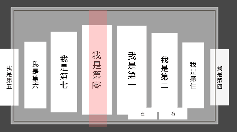

滑动效果  

点击效果（事件的响应在目标Item滚动到指定位置后调用,如果直接点击已处于目标位置的Item将会按照按钮响应规则触发）

使用外部按钮翻动

Item 宽度与间距调整

每个Item的X位置偏移

每个Item的Y位置偏移

每个Item的大小控制

奇偶Item总数的显示

根据以上控制参数可调出(左对齐与右对齐等多种效果)

本组件工包含两个脚本

EnhanceScrollView.cs		负责控制卷轴的基础样式设置与构型

ItemDrag.cs						负责每个Item的触发控制
